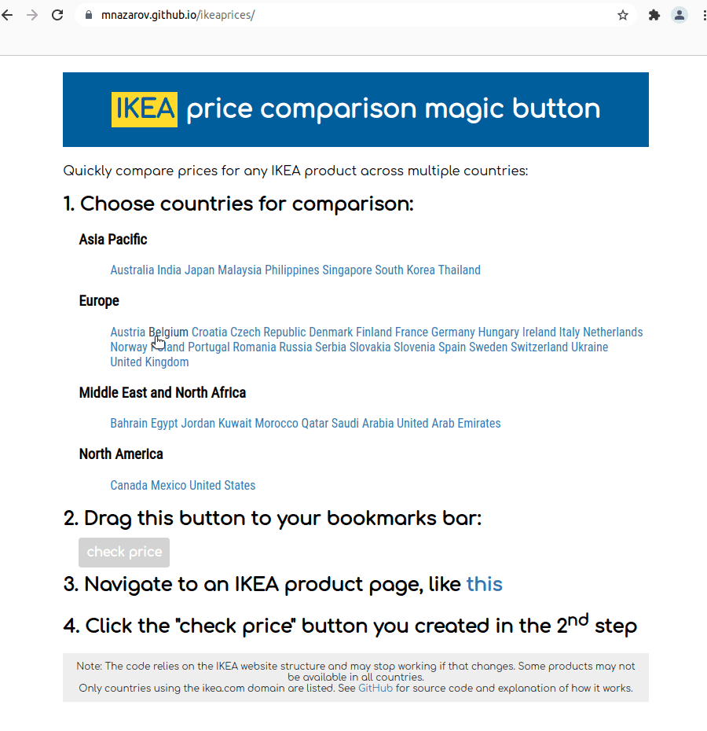

# IKEA price comparison magic button

A customizable magic button (bookmarklet) to compare IKEA prices across
countries.

Try it! &rightarrow; http://mnazarov.github.io/ikeaprices




# Idea

Living in a small country like Belgium, sometimes it pays to drive over the
border to get a good deal. Depending on the location in Belgium, within 1-2 hours
it is possible to reach IKEA in the Netherlands, Germany or France. Out of
desire to save and curiosity this tool was born.

# Implementation

Since most of the IKEA international websites are located at the same www.ikea.com domain, we can use client-side AJAX requests to other country websites from any product page.
Unfortunately there are some exceptions, such as www.ikea.lt or www.ikea.cn, and this approach won't work for them because of Cross-Origin Resource Sharing (CORS) policies.

The product URLs have the following structure: www\.ikea.com/**xx**/**yy**/p/**zzz**/
   
where **xx** is the country code (like "be" or "gb"), **yy** is the language code ("nl" or "en"), and **zzz** is the product description with article number (like _kyrre-kruk-berken-60416925_).
Luckily for us, even if the product description part of the URL is language-specific, the same links still work when changing the country/language combination. 

Now, starting from a product page we can perform the following steps:

1. Get the URL of the current page and split it into country and product information parts:
   ```js
   var url = window.location.pathname; 
   var country = url.slice(1, 6);    // e.g. "be/nl"
   var urlProduct = url.slice(6, );  // e.g. "kyrre-kruk-berken-60416925"
   ```
2. Make a list of countries we want to compare to, and for each of the country/language codes fetch the corresponding page:
   ```js
   fetch("https://www.ikea.com/" + countryToCompare + urlProduct)
   ```
3. Parse it to find the price - we use the `div` element with class `range-revamp-pip-price-package__main-price` which contains the price together with the currency symbol:
   ```js
   var doc = new DOMParser().parseFromString(data, "text/html");
   var price = doc.evaluate("//div[@class='range-revamp-pip-price-package__main-price']", doc, null, 4, null).iterateNext().textContent;
   ```
4. Show it on the current page by creating an element (linking to the
   country page) and appending it to the currently shown price which can be
   found with:
   ```js
   document.querySelector("div.range-revamp-pip-price-package__main-price").appendChild(...)
   ``` 

The full code is below (and in the [ikea.js](ikea.js) file in the repostiory):

```js
// here `countryList` is an array of selected country/language codes we want to compare to
function(countryList) {
  //  1. get URL:
  var url = window.location.pathname;
  var urlProd = url.slice(6, );
  // 2. get country
  var cnt = url.slice(1, 6);
  // 3. loop through country websites and get the prices
  var countries = countryList.filter(el => el != cnt);
  countries.forEach(function(cnt) {
    var href = "https://www.ikea.com/" + cnt + urlProd;
    fetch(href).then(response => response.text()).then(data => {
      // get price
      var doc = new DOMParser().parseFromString(data, "text/html");
      var price = doc.evaluate("//div[@class='range-revamp-pip-price-package__main-price']", doc, null, 4, null).iterateNext();
      var text = cnt.substr(0, 2) + ': ' + (price === null ? "-" : price.textContent);
      // show fetched price next to the current price
      var priceDiv = document.createElement("div");
      var priceA = document.createElement("a");
      priceA.setAttribute("href", href);
      priceA.appendChild(document.createTextNode(text));
      priceDiv.appendChild(priceA);
      (document.querySelector("div.range-revamp-pip-price-package__main-price")).appendChild(priceDiv);
    });
  })
}
```
